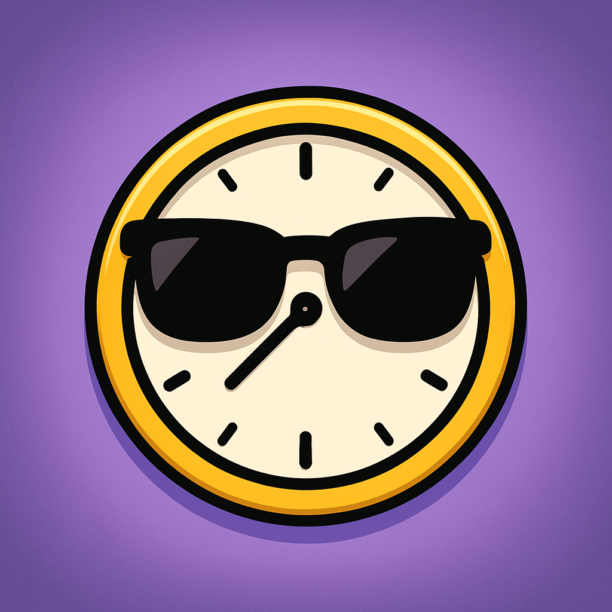

# Отчёт о взаимодействии с партнёром и участии в Карьерном марафоне

## 1. Информация о мероприятии
В рамках выполнения проектной (учебной) практики я принял участие в **Карьерном марафоне Московского Политеха**, который проходил в апреле 2026 года. 
- **Сайт марафона:** [mospolycareermarafon.ru/april2026](https://mospolycareermarafon.ru/april2026)

Мероприятие объединило студентов и представителей ведущих IT-компаний, предоставив возможность узнать о стажировках, требованиях к junior-специалистам и современных технологических трендах.

## 2. Полученные знания и навыки
В ходе посещения стендов компаний-партнеров и онлайн-встреч были получены следующие ценные знания:
- **Требования рынка:** Современные работодатели требуют не только знания синтаксиса языков программирования (Python, JavaScript), но и уверенного владения инструментами командной работы (Git, таск-трекеры).
- **Развитие Soft Skills:** Представители компаний подчеркнули важность коммуникативных навыков, умения грамотно презентовать свой проект и писать понятную техническую документацию.
- **Тренды:** Активное внедрение ИИ (LLM) во внутренние бизнес-процессы компаний для автоматизации рутины.

## 3. Связь с проектом «SmartCampus»
Участие в марафоне напрямую повлияло на развитие моего проекта «SmartCampus» (Система умного расписания и навигации):
- Я получил фидбек от представителей IT-сферы о том, что интеграция расписания в Telegram (в виде бота) гораздо удобнее для студентов, чем отдельное мобильное приложение.
- Это послужило обоснованием для выбора вариативной части практики (Разработка Telegram-бота с интеграцией LLM).

## 4. Фотоотчёт
Ниже представлены материалы, подтверждающие участие в мероприятиях Карьерного марафона:

*(Фотографии с мероприятия)*

*Рис 1. Участие в онлайн-трансляции / посещение стенда компании.*

*Рис 2. Взаимодействие с представителями организации-партнера.*